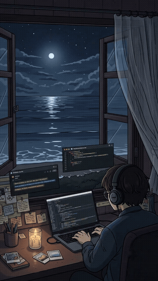

<pre>🧑‍💻 About me                                                        
  ━━━━━━━━━━━━━━━━━━━━━━━━━━━━━━━━━━━━━━━━━━━━━━━━━━━━━━━━━━━━━━━━━━━━
  🎓  Studying        →  BSc Computer Science, University of Manchester
  🤖  Interested in   →  AI, Machine Learning, Software Engineering    
  🌱  Diving deeper   →  FastAPI, PostgreSQL, AI Agents with MCP       
  🎯  Goal for year   →  Code and Learn Consistently                   
  🧩  Away from code  →  Chess, Speedcubing, Swimming                  </pre>

 

## 🛠️ My Stack

  <b>Languages</b>
   
  
  
  
  
  

  <b>Libraries &amp; Frameworks</b>
   
  
  
  
  
  
  
  

  <b>Databases &amp; Tools</b>
   
  
  
  
  
  
  

## 📊 GitHub Stats

  
  

## 🔗 Connect with Me

  
  

